# Capacitor Project Structure

## Project Overview
Capacitor is a financial management application that helps users track transactions, set and manage goals, and get recommendations on their financial activities.

## Project Diagram

```mermaid
graph TD
    A[Capacitor] --> B[index.ts]
    A --> S[src]
    
    S --> C[core]
    S --> P[patterns]
    S --> SE[services]
    S --> U[ui]
    S --> DM[demo.ts]
    S --> IX[index.ts]
    
    C --> CI[interfaces]
    C --> CM[models]
    C --> CE[enums]
    
    CI --> CI1[IAccount.ts]
    CI --> CI2[IFinancialState.ts]
    CI --> CI3[IRecommendation.ts]
    CI --> CI4[ITransaction.ts]
    
    CM --> CM1[User.ts]
    CM --> CM2[Transaction.ts]
    CM --> CM3[Goal.ts]
    
    CE --> CE1[TransactionType.ts]
    CE --> CE2[CategoryType.ts]
    CE --> CE3[GoalStatus.ts]
    
    P --> P1[strategy]
    P --> P2[state]
    P --> P3[composite]
    
    P1 --> P1a[BudgetStrategyContext.ts]
    
    P2 --> P2a[FinancialState.ts]
    P2 --> P2b[BudgetingState.ts]
    P2 --> P2c[SavingsState.ts]
    P2 --> P2d[InvestmentState.ts]
    
    P3 --> P3a[FinancialComponent.ts]
    
    SE --> SE1[budget]
    SE --> SE2[reporting]
    SE --> SE3[categorization]
    SE --> SE4[recommendations]
    
    SE1 --> SE1a[FiftyThirtyTwentyStrategy.ts]
    SE1 --> SE1b[ZeroBasedBudgetStrategy.ts]
    
    SE2 --> SE2a[ReportingService.ts]
    
    SE3 --> SE3a[TransactionCategorizationService.ts]
    
    SE4 --> SE4a[RecommendationEngine.ts]
    
    U --> U1[web]
    U --> U2[cli]
    
    U1 --> U1a[server.ts]
    U1 --> U1b[public]
    
    U1b --> U1b1[index.html]
    U1b --> U1b2[styles.css]
    U1b --> U1b3[app.js]
    
    U2 --> U2a[index.ts]
```


## Directory Structure

```
Capacitor/
├── index.ts                                # Main entry point for the application
├── STRUCTURE.md                            # Project structure documentation
├── src/
│   ├── core/                               # Core domain models
│   │   ├── interfaces/                     # Core interfaces
│   │   │   ├── IAccount.ts                 # Interface for account components
│   │   │   ├── IFinancialState.ts          # Interface for financial states
│   │   │   ├── IRecommendation.ts          # Interface for recommendations
│   │   │   └── ITransaction.ts             # Interface for transactions
│   │   │
│   │   ├── models/
│   │   │   ├── User.ts                     # User model
│   │   │   ├── Transaction.ts              # Financial transaction model
│   │   │   └── Goal.ts                     # Financial goal model
│   │   │
│   │   └── enums/
│   │       ├── TransactionType.ts          # Enum for transaction types (INCOME, EXPENSE)
│   │       ├── CategoryType.ts             # Enum for transaction categories
│   │       └── GoalStatus.ts               # Enum for goal statuses
│   │
│   ├── patterns/                           # Design pattern implementations
│   │   ├── strategy/
│   │   │   └── BudgetStrategyContext.ts    # Strategy pattern for budget calculations
│   │   │
│   │   ├── state/
│   │   │   ├── FinancialState.ts           # Base financial state class
│   │   │   ├── BudgetingState.ts           # Budgeting financial state
│   │   │   ├── SavingsState.ts             # Savings-focused financial state
│   │   │   └── InvestmentState.ts          # Investment-focused financial state
│   │   │
│   │   └── composite/
│   │       └── FinancialComponent.ts       # Composite pattern for account hierarchy
│   │
│   ├── services/                           # Application services
│   │   ├── budget/
│   │   │   ├── FiftyThirtyTwentyStrategy.ts # 50/30/20 budgeting strategy
│   │   │   └── ZeroBasedBudgetStrategy.ts   # Zero-based budgeting strategy
│   │   │
│   │   ├── reporting/
│   │   │   └── ReportingService.ts          # Service for generating financial reports
│   │   │
│   │   ├── categorization/
│   │   │   └── TransactionCategorizationService.ts # Service for categorizing transactions
│   │   │
│   │   └── recommendations/
│   │       └── RecommendationEngine.ts      # Engine for generating financial recommendations
│   │
│   ├── ui/                                 # User interface implementations
│   │   ├── web/                            # Web interface
│   │   │   ├── server.ts                   # Express server for web interface
│   │   │   └── public/                     # Public assets for web interface
│   │   │       ├── index.html              # Main HTML page
│   │   │       ├── styles.css              # CSS styles
│   │   │       └── app.js                  # Client-side JavaScript
│   │   │
│   │   └── cli/                            # Command line interface
│   │       └── index.ts                    # CLI implementation
│   │
│   ├── index.ts                            # Source entry point selector (web/cli/demo)
│   └── demo.ts                             # Demo implementation
```

## Key Components

### Core Models
- **User**: Represents a user with accounts, goals, and financial state
- **Transaction**: Represents financial transactions (income or expenses)
- **Goal**: Represents financial goals with target amounts and deadlines

### Design Patterns
- **Strategy Pattern**: Used for implementing different budgeting strategies
- **State Pattern**: Manages the user's financial state and transitions
- **Composite Pattern**: Manages account hierarchies (individual accounts, account groups)

### Services
- **Budget Services**: Different budget calculation strategies
- **Reporting Service**: Generates financial reports based on transactions
- **Categorization Service**: Categorizes transactions
- **Recommendation Engine**: Generates personalized financial recommendations

### User Interfaces
- **Web Interface**: Browser-based interface using Express, HTML, CSS, and JavaScript
- **CLI Interface**: Command-line interface using Commander and Inquirer

## Application Flow
The application can run in three modes:
1. **Web Interface**: Provides a GUI via browser
2. **CLI Interface**: Provides a command-line text interface
3. **Demo Mode**: Runs a demonstration with sample data

In all modes, the core flow remains similar:
1. Create a user with initial budgeting state
2. Add accounts and goals to the user
3. Process transactions through the user's financial state
4. Apply different budgeting strategies
5. Generate reports and personalized recommendations
